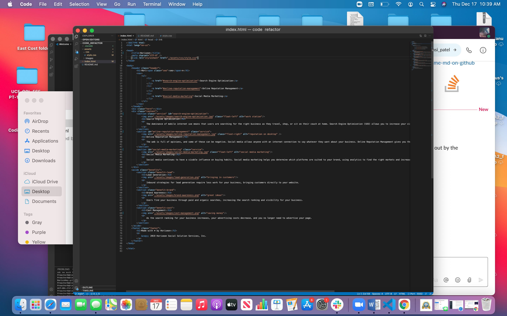
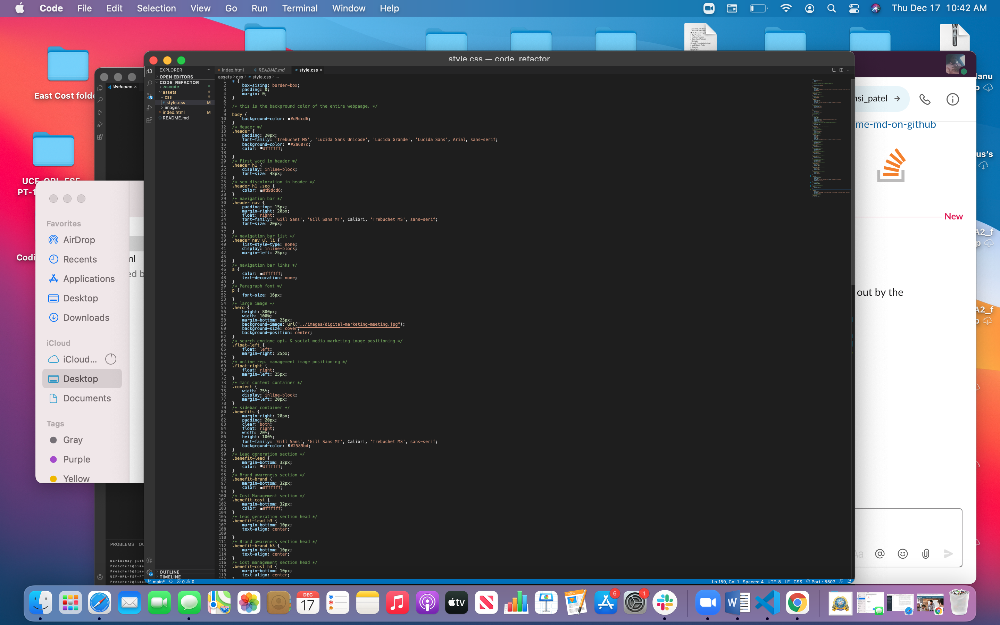

This Assignment was a refactoring assaignment where I made the HTML more 
accessible to anyone that will access this file in the future.
I added better semantic elements to better organize the coding.
<<<<<<< HEAD
This is a link to the page, https://dariushay.github.io/code_refactor/ 
I added alt attributes to images, and added comments to the css file and renamed selector elements to better organize the page.

